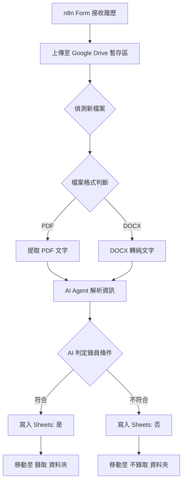

# 🤖 n8n AI 履歷自動化篩選系統 (AI Resume Screening System)

這套系統利用 **n8n** 結合 **OpenAI GPT-4o-mini**，實現了從應徵者提交履歷到 AI 自動解析、評分並分類存放的完整自動化流程。

## 🌟 系統流程亮點

1.  **前端收集**：透過 n8n Form 讓應徵者上傳 PDF 或 DOCX 格式履歷。
2.  **檔案處理**：自動辨識檔案格式，並將 PDF 或 DOCX 轉換為純文字供 AI 閱讀。
3.  **AI 深度解析**：
    * **自動提取**：姓名、最高學歷、畢業學校、所在地。
    * **重點摘要**：將技能濃縮至 30 字以內。
    * **智慧決策**：根據所在地（範例：台中市）自動判定錄取與否。
4.  **自動化存檔**：即時將資訊寫入 Google Sheets 並根據結果將檔案分類至指定雲端資料夾。

---

## 🚀 快速上手：使用 Zeabur 部署

如果您還沒有自己的 n8n 環境，推薦使用 **[Zeabur](https://zeabur.com?referralCode=cre8tiv)** 快速上線：

1.  **一鍵佈署**：在 Zeabur 服務市場中搜尋 `n8n` 並建立服務。
2.  **綁定網域**：在 Zeabur 控制面板為 n8n 綁定一個域名（如 `my-n8n.zeabur.app`）。
3.  **環境變數**：確保您的 n8n 環境變數包含 `N8N_ENCRYPTION_KEY` 以確保憑證安全。
4.  **開始自動化**：登入後即可按照下方 [匯入說明](#⚙️-匯入說明) 開始使用。

---

## 🛠️ 基礎配置步驟 (必要)

在使用本系統前，請務必手動完成以下環境設定：

### 1. 建立 Google Drive 資料夾
請在您的 Google Drive 中**手動建立以下三個資料夾**，並記錄它們的 **Folder ID**：
* **履歷**：用於存放初始接收的檔案。
* **錄取**：存放 AI 判定通過的履歷。
* **不錄取**：存放 AI 判定不通過的履歷。
* *設定位置：匯入後請將 ID 填入 `Upload file`、`Search files` 等 Google Drive 節點。*

### 2. 建立 Google Sheets 追蹤表
請**手動建立一個 Google Sheet 試算表**，並完成以下設定：
* **設定欄位名稱**：請在第一列 (Header) 填入：`Name`, `Highest Degree`, `School`, `Location`, `Skills`, `Hired`。
* **記錄文件 ID**：記錄該試算表的 **Spreadsheet ID**。
* *設定位置：匯入後請將 ID 填入 `Append row in sheet` 節點。*

---

## 📦 檔案與依賴

### 檔案清單
* `線上收履歷.json`：處理前端 Webhook 表單接收。
* `履歷達人.json`：執行 AI 判斷與檔案位移。
* 履歷資料皆是由AI生成。

### 必要插件
處理 DOCX 檔案需安裝：
* **n8n-nodes-docx-converter**：[GitHub 專案連結](https://github.com/cre8tiv/n8n-docx-converter)

---

## ⚙️ 匯入說明

1.  下載本專案的 `.json` 檔案。
2.  在 n8n 介面選擇 **Import from File**。
3.  **重新配置憑證 (Credentials)**：點開各節點並選擇您的 OpenAI、Google 帳號憑證。
4.  **填入資源 ID**：更新各節點中的資料夾 ID 與試算表 ID。

---

## 🧬 流程結構 (Workflow Structure)

